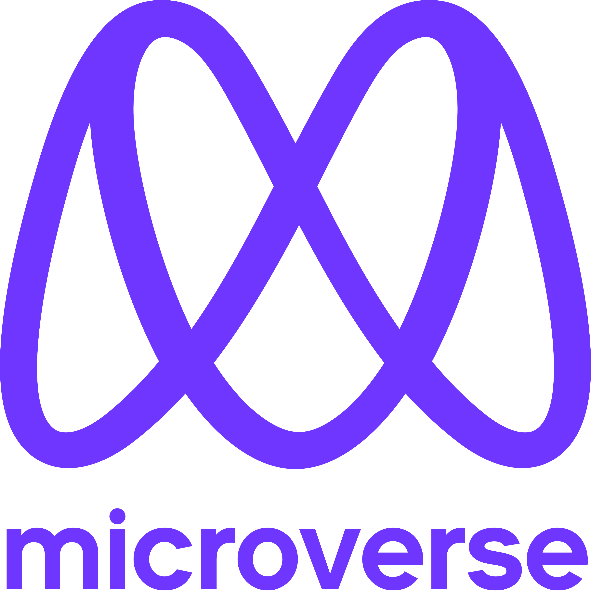

<a name="readme-top"></a>

<!--
HOW TO USE:
This is an example of how you may give instructions on setting up your project locally.

Modify this file to match your project and remove sections that don't apply.

REQUIRED SECTIONS:
- Table of Contents
- About the Project
  - Built With
  - Live Demo
- Getting Started
- Authors
- Future Features
- Contributing
- Show your support
- Acknowledgements
- License

After you're finished please remove all the comments and instructions!
-->

<div align="center">

  
  <br/>

  <h3><b>Microverse README Template</b></h3>

</div>

<!-- TABLE OF CONTENTS -->

# 📗 Table of Contents

- [📖 About the Project](#about-project)
  - [🛠 Built With](#built-with)
    - [Tech Stack](#tech-stack)
    - [Key Features](#key-features)
  - [🚀 Live Demo](#live-demo)
- [💻 Getting Started](#getting-started)
  - [Setup](#setup)
  - [Prerequisites](#prerequisites)
  - [Install](#install)
  - [Usage](#usage)
  - [Run tests](#run-tests)
  - [Deployment](#triangular_flag_on_post-deployment)
- [👥 Authors](#authors)
- [🔭 Future Features](#future-features)
- [🤝 Contributing](#contributing)
- [⭐️ Show your support](#support)
- [🙏 Acknowledgements](#acknowledgements)
- [❓ FAQ](#faq)
- [📝 License](#license)

<!-- PROJECT DESCRIPTION -->

# 📖 Coachella-Concert-Showcase <a name="about-project"></a>

> The Coachella-Concert Showcase is a simple project aimed to represent an annual concert in America. I has only two pages, the home page and the about page

## 🛠 Built With <a name="built-with"></a>
- HTML
- CSS
- Javascript

<!-- LIVE DEMO -->

## 🚀 Live Demo <a name="live-demo"></a>

- [Live Demo Link](https://royjumah.github.io/Coachella-Capstone-project/)

<!-- VIDEO WALKTHROUGH -->

## 🚀 VIDEO WALKTHROUGH <a name="live-demo"></a>

- [Walkthrough link](https://www.loom.com/share/3b693563b5224b88b809880459b8195b)

<p align="right">(<a href="#readme-top">back to top</a>)</p>

<!-- GETTING STARTED -->

## 💻 Getting Started <a name="getting-started"></a>

> Describe how a new developer could make use of your project.

To get a local copy up and running, follow these steps.

### Prerequisites


In order to run this project you need:
- Visual Studio Code or amy other equivalent code editor
- Knowledge in HTML, CSS, Javascript and Github
- An internet connection.

<!--
Example command:

```sh
 gem install rails
```
 -->


<p align="right">(<a href="#readme-top">back to top</a>)</p>

## Preview image


<!-- AUTHOR -->

## 👥 Author <a name="authors"></a>

👤 **Roy Jumah**

- GitHub: [@RoyJumah](https://github.com/RoyJumah)
- Twitter: [@_royissues](https://twitter.com/_royissues)
- LinkedIn: [@roy_jumah](https://www.linkedin.com/in/roy-jumah/)

<p align="right">(<a href="#readme-top">back to top</a>)</p>

## 🤝 Contributing

Contributions, issues, and feature requests are welcome!

Feel free to check the [issues page](../../issues/).

## Show your support

Give a ⭐️ if you like this project!

<!-- ACKNOWLEDGEMENTS -->

## 🙏 Acknowledgments <a name="acknowledgements"></a>

- Original Design idea by [Cindy Shin](https://www.behance.net/adagio07) in Behance

<p align="right">(<a href="#readme-top">back to top</a>)</p>

<!-- LICENSE -->

## 📝 License <a name="license"></a>

This project is [MIT](https://choosealicense.com/licenses/mit/) licensed

<p align="right">(<a href="#readme-top">back to top</a>)</p>
